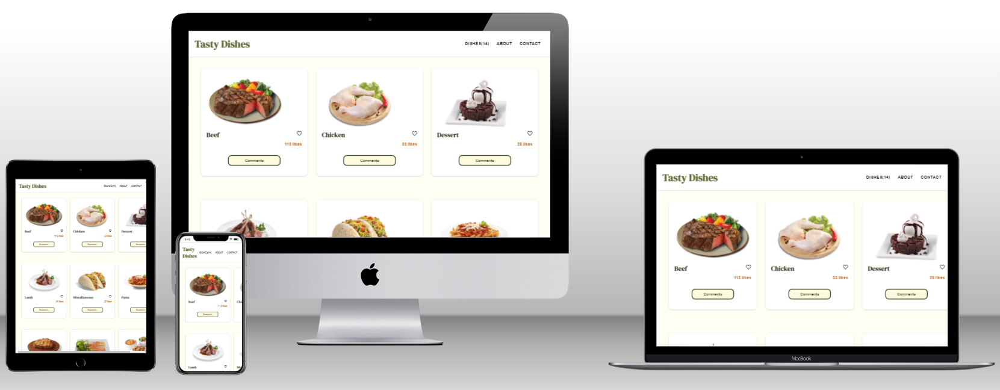

# Tasty Dishes

> The Tasty Dishes site that users can view, like & comment on their favorite dishes. Built with HTML, CSS, JavaScript, Webpack, Meals API & the Involvement API.

## Built With

- HTML5
- CSS3
- JavaScript
- Webpack
- Meals API
- Involvement API
- Postman
- Jest
- JestDom
- CommonJS
- Git
- Medium fidelity wireframe

## Preview



## Live Demo

[Live Demo Link from ./dist/index.html](https://raw.githack.com/chelmerrox/capstone-2/development/dist/index.html)

## Video Presentation


## Getting Started

To get a local copy up and running follow these simple example steps.

### Prerequisites

- HTML5 & CSS3 
- JavaScript
- Webpack
- VSCode (or any other text editor)
- Git
- GitHub
- Command line/Terminal

### Setup

From the command line, do the following steps below:

1. Clone the projects' repository into your machine.

```bash
# Clone this repository
$ git clone git@github.com:chelmerrox/capstone-2.git

```
2. Change directory/Go into the repository with the command below.

```bash
$ cd capstone-2

```

3. Run this command.

```bash
$ npm run build

```

4. Run this to deploy the site on your local machine.

```bash
$ npm start

```

## Author

👤 **Losalini Rokocakau**

- GitHub: [@chelmerrox](https://github.com/chelmerrox)
- Twitter: [@chelmerrox](https://twitter.com/chelmerrox)
- LinkedIn: [Losalini Rokocakau](https://linkedin.com/in/losalini-rokocakau)

## Collaborators

👤 **Shakhrizoda Yusupova** | GitHub: [@shyusu4](https://github.com/shyusu4)

## 🤝 Contributing

Contributions, issues, and feature requests are welcome!

Feel free to check the [issues page](https://github.com/chelmerrox/capstone-2/issues).

## Show your support

Give a ⭐️ if you like this project!

## Acknowledgments

- Our God & families
- Microverse
- Morning Session Teams
- Stand-Up Team
- Microverse TSEs
- [Meals API Documentation](https://www.themealdb.com/api.php)
- [Involvement API Documentation](https://www.notion.so/Involvement-API-869e60b5ad104603aa6db59e08150270)

## 📝 License

This project is [MIT](./MIT.md) licensed.
